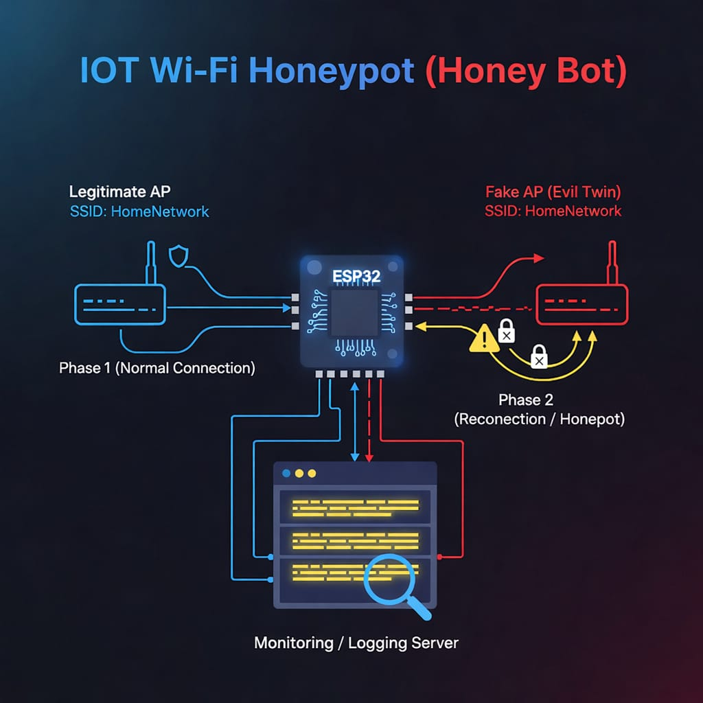

<p align="center">
  
</p>

<h1 align="center">IoT Wi-Fi Honeypot (Honey Bot)</h1>

<p align="center">
  <strong>
    IoT Security • Wi-Fi Behavioral Analysis • Evil Twin Detection
  </strong>
</p>

---

## 🚨 Project Overview

This project implements an **IoT Wi-Fi Honeypot (Honey Bot)** designed to analyze the **reconnection behavior of IoT devices** when exposed to **Fake Access Point (Evil Twin)** scenarios.

Instead of performing active exploitation, the system focuses on **behavioral analysis**, observing how an ESP32-based IoT device reacts when its legitimate Wi-Fi network becomes unavailable and a Fake AP with the same SSID is introduced.

The project demonstrates a real-world **SSID-based trust vulnerability** commonly found in IoT devices.

---

## 🎯 Problem Statement

Many IoT devices automatically reconnect to previously known Wi-Fi networks **based solely on the SSID**, without verifying the authenticity of the Access Point.

This behavior exposes IoT systems to several security risks, including:

- Evil Twin attacks  
- Traffic interception  
- Man-in-the-Middle (MitM) attacks  
- Data manipulation  

---

## 💡 Solution Approach

The project is implemented in **two phases** to analyze IoT Wi-Fi behavior in a controlled environment.

### 1️⃣ Phase 1 – Normal Operation
- ESP32 connects to a legitimate Wi-Fi network
- Reads sensor data from an LDR sensor
- Sends periodic HTTP requests to a logging server
- Uses LED feedback to confirm communication
- Establishes baseline (normal) behavior

### 2️⃣ Phase 2 – Evil Twin Scenario
- Legitimate Access Point is disabled
- A Fake Access Point with the **same SSID and password** is introduced
- ESP32 attempts to reconnect automatically
- Reconnection behavior is monitored and analyzed
- No firmware changes are made between Phase 1 and Phase 2

---

## 🧠 Behavioral Analysis

The system performs **behavioral analysis** based on:

- Wi-Fi disconnection events
- Wi-Fi reconnection timing
- Phase transitions (Phase 1 → Phase 2)
- Request frequency
- Source IP address

Based on these indicators, the behavior is classified as:

- **Normal**
- **Evil Twin Suspected**
- **Evil Twin Confirmed**

This classification is performed by the honeypot server, not by the IoT device itself.

---

## 🏗️ System Architecture

```
[ ESP32 IoT Device ]
        ↓
 Wi-Fi Disconnection
        ↓
[ Fake Access Point (Evil Twin) ]
        ↓
[ Honeypot Logging Server ]
        ↓
[ Dashboard & CSV Logs ]
```

The architecture highlights the reconnection behavior and the role of the honeypot server as a data collector and behavioral analyzer.

---

## ⚙️ Hardware Components

- ESP32 Development Board
- LDR Sensor (Light Dependent Resistor)
- LED (Actuator)
- Resistors and Breadboard
- USB Cable

---

## 🛠️ Software Stack

- ESP32 Programming: Arduino IDE
- Networking: WiFi.h, HTTPClient.h
- Backend Server: Python Flask
- Data Logging: CSV files
- Visualization: HTML Dashboard + Chart.js
- Simulation: Wokwi

---

## 📊 Collected Data

The system collects and logs the following data:

- LDR sensor readings
- Wi-Fi connection status (Connected / Disconnected)
- Phase information
- Timestamp
- ESP32 IP address
- Request count
- Attack classification

All data is visualized in real time and stored for further analysis.

---

## 🧪 Simulation Support

Due to hardware limitations in controlling Wi-Fi roaming and signal strength, a simulation environment was used to support and validate the behavioral analysis.

The simulation complements the real hardware experiment and confirms the reconnection logic.

---

## 🚀 Future Work

- RSSI-based Access Point validation
- Certificate-based Wi-Fi authentication
- Real-time alerting and notifications
- Support for additional IoT protocols
- Integration with IDS/IPS systems

---

## ⚠️ Disclaimer

This project is developed for educational and research purposes only.  
It does not perform active exploitation or unauthorized network attacks.

---

## 📌 Conclusion

This project demonstrates that IoT devices may rely on **SSID-based trust** during Wi-Fi reconnection, making them vulnerable to **Evil Twin attacks**.

The results highlight the importance of stronger authentication and validation mechanisms in IoT Wi-Fi connectivity.
